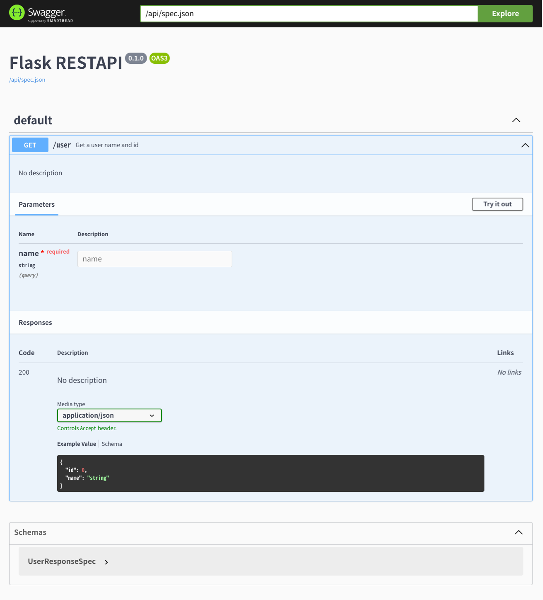

Flask-RESTAPI is an extension for Flask that is a database-agnostic framework library  
for creating REST APIs. It is a lightweight abstraction that works with your existing ORM/libraries.

It use pydantic to validate and serialize data. OpenAPI document can be automatically generated through the python decorator and it supports swagger ui display

---

## Example
```python
from flask import Flask
from flask.views import MethodView
from pydantic import BaseModel

from flask_restapi import Api, RequestParameters

app = Flask(__name__)
api = Api(app)


class UserGetSpec(BaseModel):
    name: str


class UserResponseSpec(BaseModel):
    id: int
    name: str


class User(MethodView):
    @api.query(UserGetSpec)
    @api.response(UserResponseSpec)
    def get(self, parameters: RequestParameters):
        """Get a user name and id"""
        user_name = parameters.query.name
        response = UserResponseSpec(id=1, name=user_name)
        return response.dict()


app.add_url_rule("/user", view_func=User.as_view("user"))
```

## Swagger API docs
Now go to http://localhost
